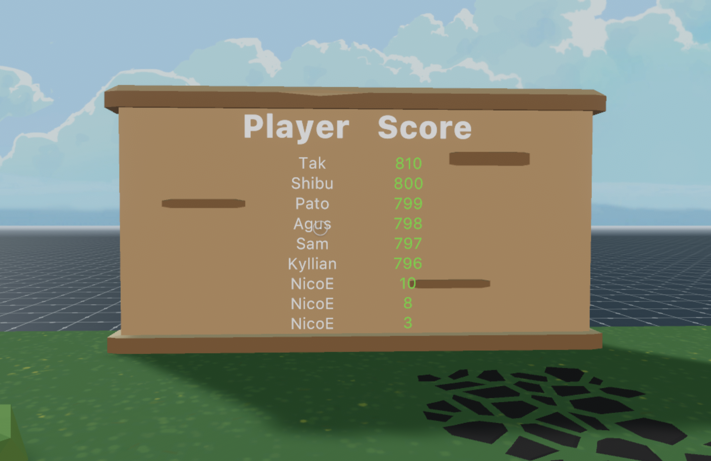
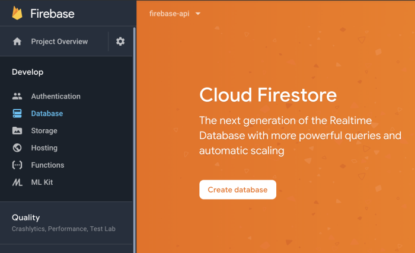
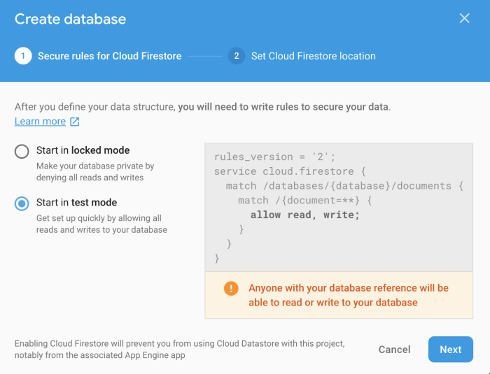
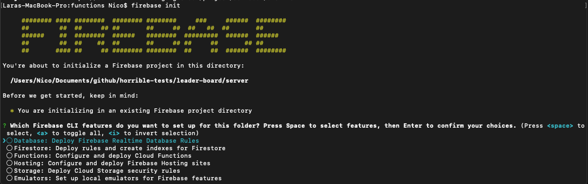

# leader-board

This is a simple scene that implements a leader board.



The scene includes a basic game of clicking a dog statue as many times as possible within 10 seconds. The score is then sent to a server for storage.

The server is only partially implemented, so that you can handle the storage where you prefer.

As a placeholder to display on the scoreboard, the scene uses sample data from a file that's packed with the scene.

The server implementation uses [Google Firebase](https://firebase.google.com/), we recommend using storage on that same server. You could also store the scores somewhere else, like an Amazon S3 server, or any other storage provider.

## Create a firebase server

The following steps will guide you through creating a firebase server.

Before you begin, install the following:

- Node 10
- NVM - Node Version Manager. [Instructions](https://github.com/nvm-sh/nvm)
- Have a Google account set up
- [Postman](https://www.getpostman.com/)

This server will make information available to the scene via HTTP RESTful requests, it will also store information sent by the scene.

## Set up project

If you don't have a [Firebase](https://firebase.google.com/) account already, start by creating one.

Go to the [Firebase console](https://console.firebase.google.com/u/0/) and click **Add Project**.

Give your project a name, and select a location to host it.

Once created, open the project and go to the Database tab.



Click “Create database” to create your initial database. Select “test mode” to enable all reads and writes easily, also select a region for hosting the database.



## Build the project scaffolding

Install the [Firebase CLI](https://firebase.google.com/docs/cli), by running:

`npm install -g firebase-tools`

With the command line tool, navigate to the folder where you want your project and run `firebase init`.



Here you'll be presented with various different services that are offered by Firebase, for this example all we really need is the **Functions** option. So hit _spacebar_ to select **Functions** and then _enter_ to continue.

The CLI then presents some more questions:

- JavaScript or TypeScript (TypeScript recommended)
- Linting Yes or No (recommended unless you have something already configured that might be in conflict)
- Install dependencies Yes or No (go for Yes)

Great, at this point we should have the project all set up and ready to start working! Explore the folders that were created. If you use TypeScript, you'll see a `functions` folder with the following files:

- `package.json`
- `tsconfig.json`
- `node_modules` folder
- `lib` folder
- `src/index.ts`

Almost all of our work will be with the `index.ts` file, you can ignore most of the rest.

## Creating an endpoint

We'll be using the Express library to host a "serverless" API. What's commonly referred to as a "serverless" API can elicit some confusion, because you are setting up a server, after all.

What's different between this and traditional server hosting, is that the environments where your code runs are completely managed by the provider, you just need to write your code, and not worry about things like updating the OS. It also means that you don't have a machine or a portion of a machine that's continually dedicated to running your code. Instead a virtual machine is instanced on demand whenever its endpoints are hit, and then those resources return back into the pool of goo that they came from.

Open the `index.ts` file and paste the following code, to create your first endpoint:

```ts
const functions = require('firebase-functions')
const admin = require('firebase-admin')
const express = require('express')
const cors = require('cors')
const app = express()
app.use(cors({ origin: true }))

app.get('/hello-world', (req: any, res: any) => {
  return res.status(200).send('Hello World!')
})

exports.app = functions.https.onRequest(app)
```

This script relies on a couple of dependencies that must be installed, so on the terminal run the following commands:

```
npm i express
npm i cors
```

Here's some detail about the various things you're importing to the project, through those `require` statements.

- `firebase-functions`: lets you create serverless functions to run on Firebase.
- `firebase-admin`: lets you controll the back-end Firebase services
- `express`: lets you create a server instance to handle the requests
- `cors`: Lets your functions and content be accessed by external sites (like Decentraland, for example)

Once the express server is set up, we're using [express routing](https://expressjs.com/en/guide/routing.html) to define the routes of our endpoints. `app.get('/hello-world', ...` makes that part of the code listen for `GET` HTTP requests to the `/hello-world` sub-url. `(req: any, res: any)` defines a `req` object, that contains all of the additional data in the request, and a `res` object, that will be sent as a response to the caller.

When this endpoint is called, it retunrs a _'Hello World!'_ string, with an HTTP status code of `200`, which is universally recognized as a success response.

Finally, `exports.app = functions.https.onRequest(app)` exposes the express application to Firebase.
